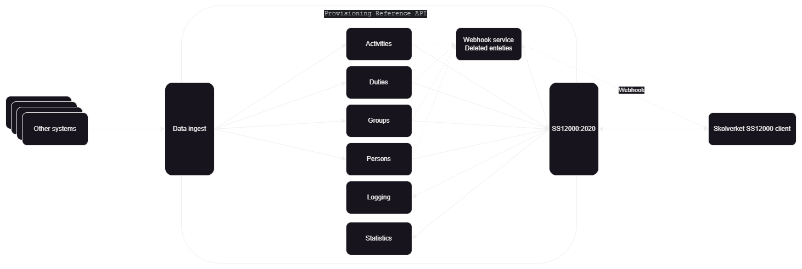

# Provisioning Reference API

The Provisioning Reference API is implementing a subset of
the [SIS SS 12000](https://www.sis.se/produkter/informationsteknik-kontorsutrustning/ittillampningar/ittillampningar-inom-utbildning/ss-120002020/)
standard with interpretations made by Statens Skolverk ('Skolverket'), the Swedish National Agency for Education.
This project serves as a reference implementation or example of the "pull method" of provisioning for digital national
tests, the 'digitala nationella prov' in Swedish, abbreviated ('DNP'). While it does work out of the box, it is not to
be considered a
finished product and is not intended to run in a production environment.

## Architecture

The Provisioning Reference API exposes two REST APIs through two gateways: one gateway for data ingest and the other
gateway implementing a subset of SS 12000.

Data ingest gateway is for ingesting data in the system and thus intended to be behind a firewall and not exposed.
There is no authentication or authorization implemented for the data ingest gateway. SS 12000 API gateway complies
with a subset of the SIS SS 12000 standard and is intended to represent the exposed API that Skolverket will talk with
to retrieve data.

Incoming request to any of the two gateways are routed to the underlying services with REST and based on the first path
segment e.g., a request to `/persons/abcd123?param=1` is routed to the `persons` service to the path `/abcd123?param=1`.
All headers are passed along with the request.
The underlying services are retrieved
from [Vert.x Service Discovery](https://vertx.io/docs/vertx-service-discovery/java/)
and filtered on metadata in the service discovery record.
Underlying services are in practice freestanding REST API services. This makes it quick and easy to expand on the
functionality of the Provisioning Reference API, simply register additional services with the supporting metadata
depending on from where the service is to be available.



### Service Discovery metadata

In addition to the service name a metadata object is attached to the service discovery record. This metadata object
specifies where the service is to be reachable and what metods are allowed from the SS 12000 gateway (called '
expose'). All methods are allowed from the ingest endpoint as it's considered internal and not exposed.

```json
{
  "ingest": true,
  /* Boolean */
  "expose": true,
  /* Boolean */
  "allowedMethods": [
    "GET",
    "POST",
    "PUT"
  ]
  /*HTTP methods to be exposed to the 'expose' gateway (SS 12000 API gateway)*/
}
```

### Data ingest gateway

`se.skolverket.service.provisioning.provisioningreferenceapi.dataingest.DataIngestGatewayVerticle`
An API for ingesting data into the Provisioning Reference API. It is registered to port 8889 by default. All services
registered for service discovery with the metadata flag `ingest` set to `true` will receive requests regardless of
chosen HTTP method. An OpenAPI specification is available in the `src/main/resources/openapi/ingest/openapi` folder and
a SwaggerUI is available at [localhost:8889/openapi/index.html](http://localhost:8889/openapi/index.html).

### SS 12000 API Gateway

`se.skolverket.service.provisioning.provisioningreferenceapi.SS 12000api.SS 12000ApiGatewayVerticle`
Skolverket's interpretation and subset of SIS SS 12000. It is registered to port 8888 by default. Services registered
for service discovery with the metadata flag `expose` set to `true` will receive request based on HTTP metods stated in
metadata list `allowedMethods`. An OpenAPI specification is available in the `src/main/resources/openapi/expose/openapi`
folder and a SwaggerUI is
available at [localhost:8889/openapi/index.html](http://localhost:8888/openapi/index.html).

#### Auth, JWT

Requests to the SS 12000 API Gateway are expected to contain a JWT bearer
token, [see configuration on how to configure this](#configuration).
Example of an excerpt of the JWT claims can bee seen bellow.

```json
{
  "aud": "nutid test",
  "entity_id": "https://login-test.skolverket.se",
  "exp": 1697102108,
  "iat": 1696238108,
  "nbf": 1696238108,
  "organization_id": "SE1231231231",
  "requested_access": [
    {
      "locations": [
        "http://ss12000location.dev.skolverket.se:8888"
      ],
      "type": "ss12000-api"
    }
  ]
}
```

If auth is enabled, `requested_access.locations` for the node with type `ss12000-api` will be matched to the location set in the configuration to ensure that
the current instance of Provisioning Reference API is the intended target, thous preventing JWT reuse. If a location in `requested_access.locations` contains the configured location the request is allowed to proceed.
If `requested_access.locations` contains `https://localhost/abc/123` and the current location is configured to `https://localhost` the request is allowed to proceed.


### Services

#### Activities

Handles the SS 12000 data type `Activities`. Enables CRUD operations on activities. `GET` is exposed via the SS 12000
API Gateway. When creating (`POST`) or updating (`PUT`) the format and relation of each activity is verified.
It is verified that referenced groups and referenced duties exist, if not an error 400 is returned.
When a activity is deleted, the deleted entities service is notified on the internal even bus. When a activity is
created or modified the subscription service is notified on the internal even bus.

#### DeletedEntities

Handles the SS 12000 data type `DeletedEntities`. Enables read (`GET`) operations of deleted entities. `GET` is exposed
ia the SS 12000 API Gateway. Deleted entities are created by the other services and not via `POST` or `PUT`.
When deleted entities have been added, the subscriptions service is notified.

#### Duties

Handles the SS 12000 data type `Duties`. Enables CRUD operations on duties. `GET` is exposed via the SS 12000 API
Gateway. When creating (`POST`) or updating (`PUT`) the format and the relation of each duty is verified.
It is verified that referenced persons exist, if not an error 400 is returned. When a duty is deleted, the deleted
entities service is notified on the internal even bus. When a duty is created or modified the subscription service is
notified on the internal even bus.

#### Groups

Handles the SS 12000 data type `Groups`. Enables CRUD operations on groups. `GET` is exposed via the SS 12000 API
Gateway. When creating (`POST`) or updating (`PUT`) the format and the relation of each group is verified.
It is verified that referenced persons exist, if not an error 400 is returned. When a group is deleted, the deleted
entities service is notified on the internal even bus. When a group is created or modified the subscription service is
notified on the internal even bus.

#### Logging

Handles SS 12000 data type `LogEntry`. Enables create (`POST`) and read (`GET`) operations of logs. `POST` is exposed
ia the SS 12000 API Gateway. Used to report logs back from Skolverket SS 12000 Client used by the pull method for
provisioning.

#### Persons

Handles the SS 12000 data type `Persons`. Enables CRUD operations on persons. `GET` is exposed via the SS 12000 API
Gateway. When creating (`POST`) or updating (`PUT`) the format is verified.
When a person is deleted, the deleted entities service is notified on the internal even bus. When a person is created or
modified the subscription service is notified on the internal even bus.

#### Statistics

Handles SS 12000 data type `StatisticsEntry`. Enables create (`POST`) and read (`GET`) operations of statistics
entries. `POST` is exposed via the SS 12000 API Gateway. Used to report statistics back from Skolverket SS 12000 Client
used by the pull method for provisioning.

#### Subscriptions

Handles the SS 12000 data type `Subscription` and the logic of webhooks. Enables create (`POST`) and delete (`DELETE`)
of subscriptions. `POST` and `DELETE` is exposed via the SS 12000 API Gateway. The subscriptions service is available on
the event bus for incoming notifications from other services. When a notification is received, the data type is checked
and all subscriptions matching the data type is retrieved from the database.
Each of these subscriptions will get a webhook with information about the update in accordance with SS 12000. Multiple
attempts are made to reach the target of the webhook, by default 4 attempts are made.

## Database

Provisioning Reference API uses MongoDB. The MongoDB connection is configured with env (or in the config.json file)
variables `REF_API_MONGO_HOST` and `REF_API_MONGO_PORT`.

## Configuration

Provisioning Reference API pulls its configuration from 4 sources. They are pulled in the priority order listed bellow,
where 1 overwrites 2 and 2 overwrites 3 and so on.

1. The environment variables
2. A conf/config.json file. This path can be overridden using the vertx-config-path system property or VERTX_CONFIG_PATH
   environment variable.
3. The system properties
4. The Vert.x verticle config()

### Configuration options

| Parameter                          | Data type | Required                                        | Default                                                      | Description                                                                                                                                                                                         |
|------------------------------------|-----------|-------------------------------------------------|--------------------------------------------------------------|-----------------------------------------------------------------------------------------------------------------------------------------------------------------------------------------------------|
| `REF_API_MONGO_HOST`               | String    | No                                              | `localhost`                                                  | MongoDB host.                                                                                                                                                                                       |
| `REF_API_MONGO_PORT`               | Integer   | No                                              | 27017                                                        | MongoDB port.                                                                                                                                                                                       |
| `CONFIG_KEY_VALIDATION_BASE_URI`   | String    | No                                              | `https://no-configured-url.com`                              | Base URI for JsonSchema validation. Not needed.                                                                                                                                                     |
| `SS12000_AUTH_JWKS_URI`            | String    | Yes (if IGNORE_JWT_WEBHOOKS is not set to true) | -                                                            | URI to JWKs enpoint to get keys for verifying JWT. E.g https://school.skolverket.se/wkt/jwks.json.                                                                                                  |
| `SS12000_AUTH_IGNORE_JWT_WEBHOOKS` | String    | No                                              | `false`                                                      | If Webhooks to the webhook api should ignore JWT from the client. <br/>Options `true` and `false`. If set to true, JWT is not verified. <br/>If set to true, a default user is applied. See bellow. |
| `AUTH_URI`                         | String    | Yes                                             | `https://nutid-auth-test.sunet.se/transaction` (config.json) | Sunet endpoint for GNAP mTLS token exchange.                                                                                                                                                        |
| `AUTH_CLIENT_KEY`                  | String    | Yes                                             | `https://client.key` (config.json)                           | GNAP client key that will be used in token exchange.                                                                                                                                                |
| `AUTH_PKCS_PATH`                   | String    | Yes                                             | `src/main/resources/pkcs/ss12k-ref.p12` (config.json)        | Path to PKCS/p12 file. Provided file is for test, will not work in dev or prod.                                                                                                                     |
| `AUTH_PKCS_PASSWORD`               | String    | Yes                                             | `Bfv@U4bT5yzL3s7B` (config.json)                             | Passwrod for PKCS/p12 file. Default passwrod is for provided file.                                                                                                                                  |
| `AUTH_ALIAS`                       | String    | Yes                                             | `ss12k-ref` (config.json)                                    | Alias for identity to use in the PKSC/p12 file.                                                                                                                                                     |
| `AUTH_JWT_CLAIM_LOCATION`          | String    | No                                              | `localhost`                                                  | Location of the current instance of Provisioning Reference API. Will be validated against the JWT claims if Auth is enabled.                                                                        |

## Building

To launch your tests:

```shell
mvn clean test
```

To package your application:

```shell
mvn clean package
```

To run your application:

```shell
java -jar target/provisioning-reference-api-1.0.0-SNAPSHOT.jar -conf src/main/resources/conf/config.json
```

Run MongoDB with Podman/Docker

````shell
podman run -dt -p 27017:27017/tcp docker.io/library/mongo:latest
````

Run with Docker compose:

````shell
docker compose up --build
````

## Technologies used

### OCI containers

A Dockerfile is provided to ease packaging and deployment together with a docker-compose file for ease of testing and
prototyping.
https://podman.io/

### Eclipse Vert.X

[Eclipse Vert.X](https://vertx.io/) is a reactive JVM framework for building event driven applications and allows for
high concurrency.
Chosen for this project due being event driven and having large open source community.

### Project lombok

https://projectlombok.org/

## Deployment

Skolverket hosts the Provisioning Reference API in a Kubernetes environment and in test-container for CI/CD pipelines,
example deployment for Kubernetes is provided under the `deployment` folder.
**Warning:** The deployment examples exposes both gateways on Kubernetes service type `LoadBalancer`. Depending on your
environment this might open the service up to external traffic.
